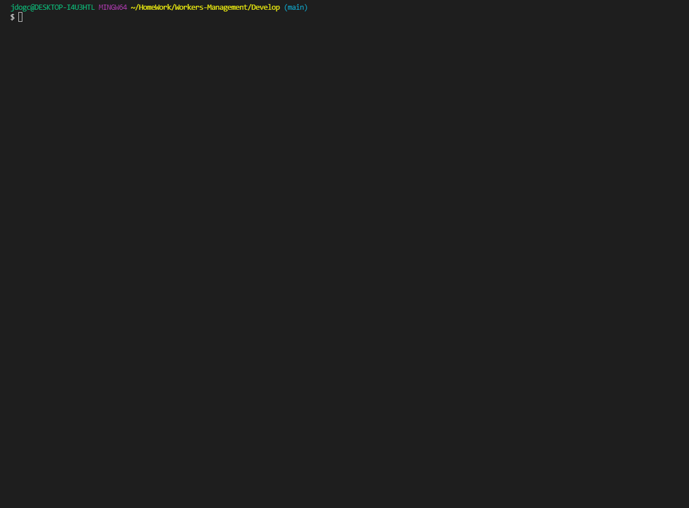

<h1 style="text-align: center;">README Builder</h1>

[[Demo-Video]](https://www.youtube.com/watch?v=_GWGm9Vq7zI)

[[Preview]](#Preview)

## General overview: 

 
For this project my goal was to create a Workers-Management Tool that will allow the user to create a team using Node.js & JavaScript. I used inquirer and fs to create the tool along with some help from AC htmlRenderer. Using prompts in the terminal you can build a page instantly after making your choices. After filling out the prompts the script will take in user inputs and drop them in an array and feed them to the renderer. The render will take those built employees and put them in respective places on the template. The template will be combined and then finally put on the output team.html. Once completed the user will be given a notice that the render is completed and to check the output folder.

<h3 style="text-align:center;">Instructions</h3>

1. Initialize the app in the terminal using: `node index.js`
2. Once complete fill out the prompts presented
3. After the prompts are filled and terminal logs `Completed` your file will be created!
4. Review and enjoy your newly custom built TEAM in the output folder!

<h3 style="text-align:center;">JS-Summary</h3>

* Added Packages needed for the application
* Added classes for Employees, Manager, Intern and Engineer
* Added tests for each class
* Added function that prevents user from leaving input empty
* Added prompts in terminal for the user to input data for the app to collect
* Added function that collects data from each input
* Added if statements for menu depending on which one the user picks will create a new team member
* Added basic template that gets filled dynamically based off user input
* Added function that writes a new readme file using the newly updated template

>Notes: HtmlRenderer looks really intriguing, im glad I didn't have to figure that out for this project ;)

## Preview

